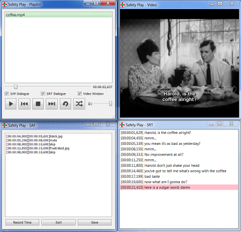
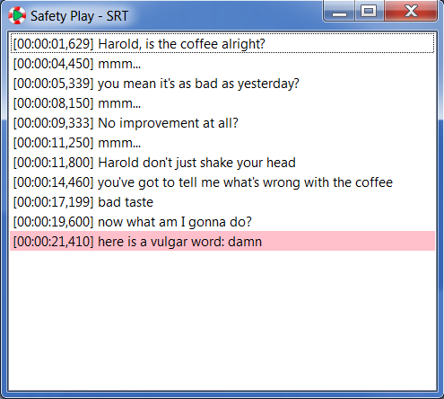
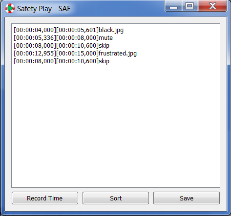

#SafetyPlay 

Edit your movies without changing the source file. Users create a text file with instructions on when to skip, mute, or black out media during playback. SafetyPlay plays the video according to the text file's instructions.

##Playing Media
To play some filetypes on Windows, you'll need to install a codec pack such as [K-Lite Mega](http://www.free-codecs.com/download/k_lite_mega_codec_pack.htm). Be careful during installation as they will invite you to install internet toolbars etc. 

To play a media file in SafetyPlay, drag it into the playlist window and double click or press play.

```
Keyboard Shortcuts
P = Play/Pause
R = Revert to last playlist item
S = Stop
J = Jump to next playlist item
Alt + Right Arrow = Shuttle Forward
Alt + Left Arrow = Shuttle Backward
Shift + Right Arrow = Jog Forward
Shift + Left Arrow = Jog Backward
Scroll Wheel Up = Volume Up
Scroll Wheel Down = Volume Down
F (on video Window) = Fullscreen
Esc = Undo Fullscreen
Ctrl + Up Arrow = Move selected item(s) up in playlist
Ctrl + Down Arrow = Move selected item(s) down in playlist
```

##Subtitles
.srt files are text files that hold subtitles for a movie. For most movies, .srt files can be downloaded online. Upon opening a video file, SafetyPlay will look for a .srt file in the same folder as the video file and will attempt to load a .srt file into the SRT dialogue window. To be loaded automatically, the srt file must have the same file name as the video. Only certain filetypes such as .Mp4 will allow subtitles to be played during video playback.

To open the srt dialogue, check the box near the playlist window. 

SafetyPlay automatically searches through the words in a .srt file and compares them to a library of vulgar words located in a .txt file in the same directory as SafetyPlay.exe. When a match is found, the line is highlighted in pink. You can jump to any spot in a playing video by doubleclicking the line in the SRT dialogue. You can add or remove vulgar words from the vulgar.txt to match your own preferences.



##Editing Media 
.saf files hold information that enables SafetyPlay to censor media. They are text files and can be opened and edited using any text editor. The built in text editor can be enabled by checking the box 'srt dialogue'. Drag and drop the .saf file you want to edit or load a video and begin editing the saf file for that video. Each line in a saf file must have a beginning time code, an end timecode, and an instruction. for example:

[00:00:08,000][00:00:10,600]skip

In this example, the player will skip the video from 8 seconds to 10.6 seconds. Other functions include muting and showing a .jpg image. See the 'example' folder in the same directory as SafetyPlay.exe for more examples.

.saf files must be stored in the same location as the video file and must have the same filename.



##Building SafetyPlay
1. Install [Python](https://www.python.org/), [PySide](https://pypi.python.org/pypi/PySide/1.2.4), and Phonon
2. Install [Cx_Freeze](http://cx-freeze.sourceforge.net/)
3. Open the command prompt, cd to the source folder where your SafetyPlay.py, setup.py, and icon.ico files are located.
4. run: python.exe setup.py build
5. Go to the build folder and add vulgar.txt and the 'images' folder.

##Download

####Windows 64bit
[SafetyPlay Version 1.6](https://drive.google.com/file/d/0ByCbzbfsSzJLMzdrSEY1U3U0Smc/view?usp=sharing)